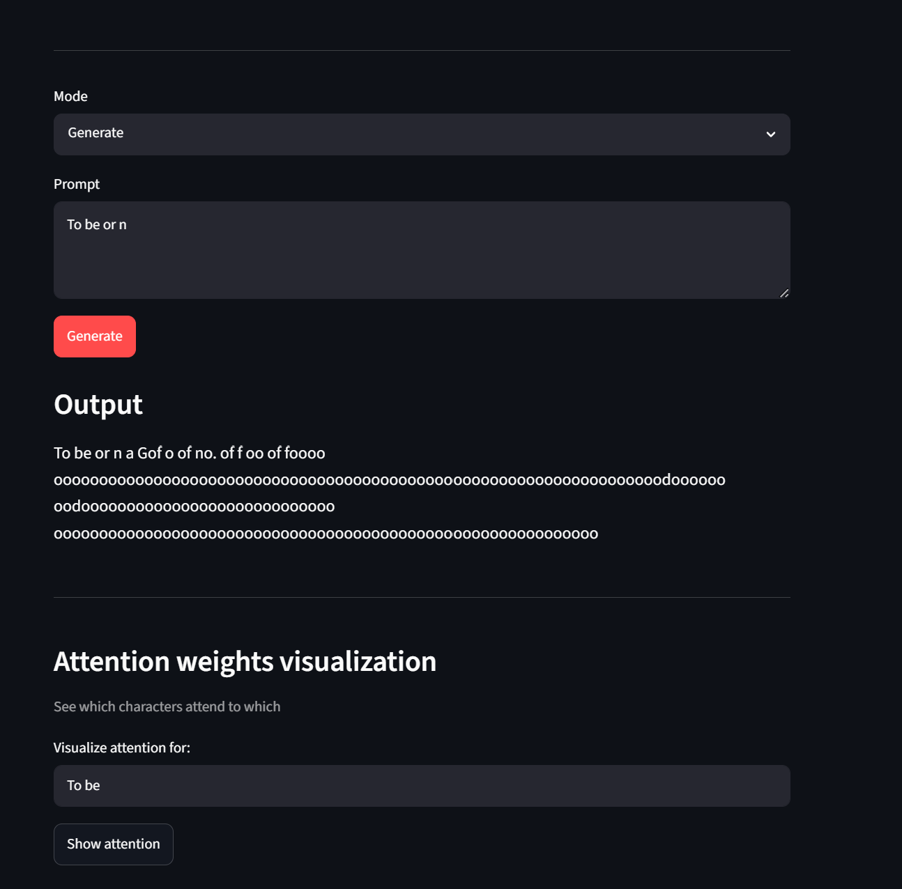
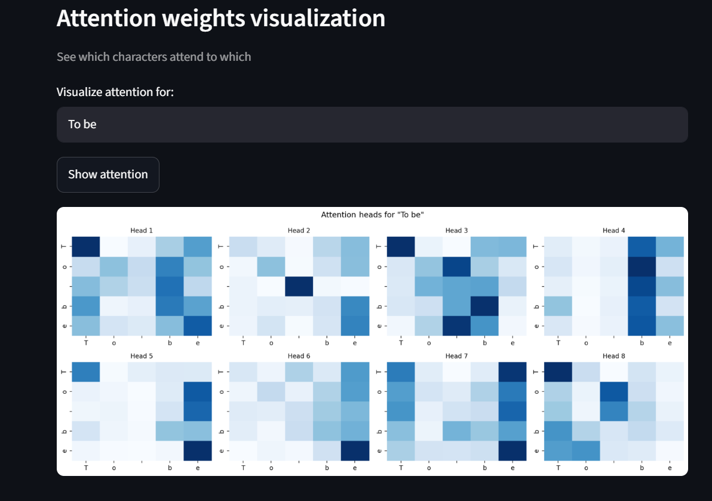
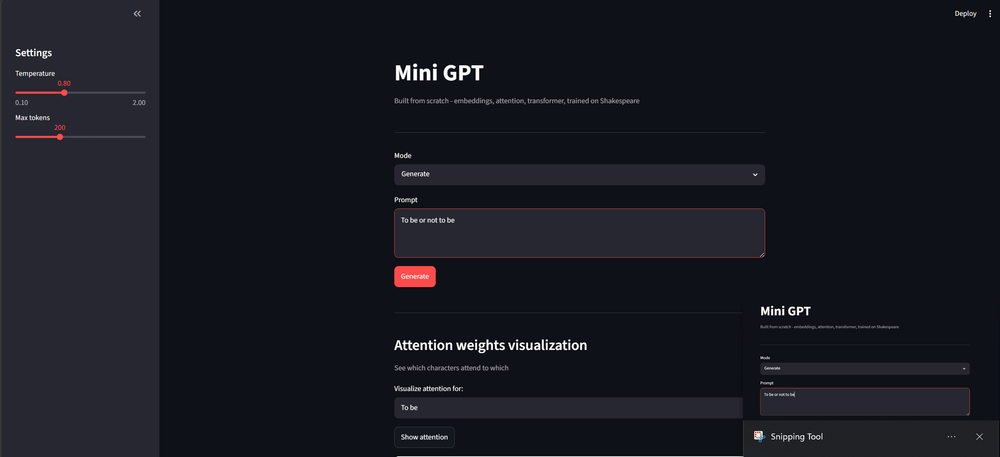

# Mini GPT — Transformer Built From Scratch


A minimal GPT implementation built from scratch in PyTorch, trained on 1.1M tokens of Shakespeare. Every component — embeddings, attention, FFN, training loop — is hand-coded without high-level abstractions.

> **[Live Demo →](https://your-app.streamlit.app)** &nbsp;|&nbsp; Character-level text generation with real-time attention heatmap visualization

---

## Architecture

```
Input text
    │
    ▼
Token Embedding (vocab=65, d_model=64)
    +
Positional Encoding (sinusoidal, max_len=128)
    │
    ▼
┌─────────────────────────────────┐
│       Transformer Block × 3     │
│                                 │
│  ┌──────────────────────────┐   │
│  │  Multi-Head Attention    │   │
│  │  (8 heads, d_k=8 each)  │   │
│  └──────────┬───────────────┘   │
│             │ + residual        │
│         Layer Norm              │
│             │                   │
│  ┌──────────▼───────────────┐   │
│  │  Feed-Forward Network    │   │
│  │  Linear(64→256)→GELU     │   │
│  │  Linear(256→64)          │   │
│  └──────────┬───────────────┘   │
│             │ + residual        │
│         Layer Norm              │
└─────────────┼───────────────────┘
              │
              ▼
     Linear Output Head
     (d_model=64 → vocab=65)
              │
              ▼
     Next character prediction
```

---

## Model Config

| Parameter    | Value  | Notes                              |
|--------------|--------|------------------------------------|
| `d_model`    | 64     | Embedding / hidden dimension       |
| `num_heads`  | 8      | d_k = 8 per head                   |
| `num_layers` | 3      | Stacked transformer blocks         |
| `d_ff`       | 256    | 4× expansion in FFN (standard)     |
| `max_len`    | 128    | Context window / causal mask size  |
| `vocab_size` | 65     | Unique chars in Tiny Shakespeare   |
| Parameters   | ~158k  | Intentionally small — interpretable|

---

## Project Structure

```
mini-gpt/
├── model/
│   ├── embeddings.py      # Token + positional encoding
│   ├── attention.py       # Scaled dot-product, multi-head attention
│   ├── transformer.py     # Transformer block + FFN + residuals
│   └── gpt.py             # Full GPT assembly
├── training/
│   ├── dataset.py         # Data loading, char tokenization
│   └── train.py           # Training loop, loss, optimizer
├── app/
│   └── streamlit_app.py   # Interactive UI + attention heatmap
├── data/
│   └── input.txt          # Tiny Shakespeare (1.1M tokens)
└── README.md
```

---

## Quickstart

**1. Install dependencies**
```bash
pip install torch streamlit matplotlib seaborn
```

**2. Train the model**
```bash
python training/train.py
```

**3. Launch the app**
```bash
streamlit run app/streamlit_app.py
```

## Screenshot





---

## What I Learned

Building this from scratch required understanding every component at the math level, not just the API level:

- **Scaled dot-product attention** — why dividing by √d_k prevents softmax from saturating into near-zero gradients at large dot-product magnitudes
- **Positional encoding** — attention is permutation-invariant by design; sinusoidal encodings inject token order without adding learned parameters
- **Residual connections + layer norm** — residuals let gradients bypass layers cleanly; layer norm re-centres activations and keeps training stable through 3 blocks
- **Multi-head parallelism** — each head learns a different relational subspace (syntax, proximity, coreference) concurrently, then concatenated
- **Backpropagation** — traced the full gradient path: cross-entropy loss → logits → output head → layer norm → attention weights → embeddings
- **GELU over ReLU in FFN** — smooth gating avoids dead neurons; matches what production transformers use

---

## Stack

Python · PyTorch · Streamlit · Matplotlib · Seaborn

---

## References

- [Attention Is All You Need](https://arxiv.org/abs/1706.03762) — Vaswani et al., 2017
- [nanoGPT](https://github.com/karpathy/nanoGPT) — Andrej Karpathy


